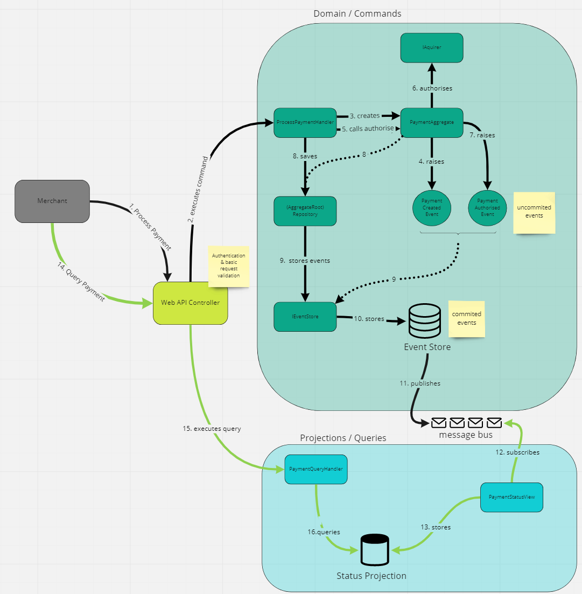

# Design & approach

## Assumptions

* It's OK to store full-on PCI data (full PAN/CVV/Expiry/CardHolderName) in our datastore for now - will need to come up an approach to secure that later (e.g. encryption, or tokenisation).
* The acquiring bank doesn't have to be out-of-process - so another API accessible over HTTP (it can just be a simple class for now).
* We can ignore any GDPR concerns for now.
* We’ll ignore any payment authentication concerns (i.e 3DS) - so the response from the acquiring bank will either be authorised, or declined (and maybe processing errors).
* We could support multiple acquiring banks, but it seems prudent to just have a single bank initially.
  

## Initial design considerations

* Our payment gateway will need to be accessed by multiple merchants, so putting a JSON API on the internet, seems like an obvious decision.
* Merchants need to know whether payments are successful or not. Possibly we could implement this asynchronously - e.g. by putting payment requests on a queue (returning 202 Accepted to the merchant); then notifying the merchant of the eventual result via webhooks - however, this will add complexity for our merchants, and seems against the purpose (which is to make processing payments easy for merchants).
* Merchants need to be individually authenticated, when both processing payments & retrieving details - an API key issued per merchant seems a suitable approach - probaly this will be sent in a header (over HTTPS).
* Use OpenAPI to auto generate document our API internally.
* Seems sensible to try and separate reads from writes - they will have differing requirements, so using CQRS & allowing for different datastores seems sensible - and will improve scalability.
* With critical financial data, we could investigate an event-sourcing approach - this is where we store domain events in an append-only log (event-store); the application’s state is determined by those stored events;  this also works well with the CQRS approach (I've also never had an excuse to use event-sourcing - so will be a good learning experience!).
* Follow clean architecture principles (equivalent to hexagonal/onion).
* Try to use TDD - this combined with clean architecture, will mean the tests target the application (mocking out dependencies); increasing development speed overall.
* .NET 6 is the latest .NET tech & has LTS - build the API in that & our application libraries in .NET Standard 2.1 to maximise potential re-use

## Implementation

I used [clean architecture](https://blog.cleancoder.com/uncle-bob/2012/08/13/the-clean-architecture.html):

See also [Onion](https://jeffreypalermo.com/2008/07/the-onion-architecture-part-1/) / [Hexagonal](https://alistair.cockburn.us/hexagonal-architecture/) architecture

In the above diagram, the inner 2 (`Use Cases` and `Entities`) layers form our application; the `Use Cases` layer also _defines_ any external dependencies (so datastores/external systems etc.) - these are "ports" - e.g ICustomerRepository in C# terms. These "ports" are then implemented in the green "Interface Adapters" layer - e.g. MySqlCustomerRepository in C# terms.

Note that external boundaries and frameworks are in the outer layer; e.g. MVC / Web API controllers - where they become an implementation detail, along with databases.

This approach works very well with TDD, because tests target the `Use Cases` layer (using mocked "ports"). 

This is the approach I followed - starting with the [CheckoutChallenge.Application](https://github.com/roblascelles/CKOChallenge/tree/master/src/CheckoutChallenge.Application) library (`Use Cases`) & building up functionality with TDD tests ([CheckoutChallenge.Application.Tests](https://github.com/roblascelles/CKOChallenge/tree/master/test/CheckoutChallenge.Application.Tests)).

Other projects were added later, as required:

* [CheckoutChallenge.WebAPI](https://github.com/roblascelles/CKOChallenge/tree/master/src/CheckoutChallenge.WebAPI) - the .NET 6 ASP.NET Web API; includes request validation & authentication
* [CheckoutChallenge.WebAPI.Tests](https://github.com/roblascelles/CKOChallenge/tree/master/test/CheckoutChallenge.WebAPI.Tests) - tests for the above
* [CheckoutChallenge.Acquirers.Faked](https://github.com/roblascelles/CKOChallenge/tree/master/src/CheckoutChallenge.Acquirers.Faked) - faked acquirer implementation
* [CheckoutChallenge.DataStores.InMemory](https://github.com/roblascelles/CKOChallenge/tree/master/src/CheckoutChallenge.DataStores.InMemory) - in memory datastore adapters - used to run locally

Once I had the basic flow working, I evolved the solution to use CQRS (so splitting the datastores - by raising events & storing projection); & finally to use event sourcing.

### CQRS/event-sourcing flow 

Event-sourcing approach gleaned from:
* https://github.com/gregoryyoung/m-r  
* http://www.andreavallotti.tech/en/2018/01/event-sourcing-and-cqrs-in-c/ 

CQRS/event-sourcing flow & responsibilities:

From [Miro board](https://miro.com/app/board/uXjVOP8QxT8=/?invite_link_id=60414425877)

### Areas for Improvement
* add validation to the domain (e.g expiry dates/Luhn check)
* investigate tokenisation/encryption options for PCI data
* add another Web API for the fake-aquirer - so communicating over HTTP
* allow for an actual database (for projection & events)
* support an actual message bus
* add structured logging
* metrics

### Productionise
* merchants & API Keys retrieved from somewhere external
* add metrics - e.g: stats for
  * request times & counts
  * response codes
  * errors/exceptions
  * acquirer response codes
  * acquirer response times
* request message/tracing 

Also, merchants will require API documentation - which will need to be much more detailed, and hand-holding, than OpenAPI/Swagger - maybe see if there's a [Hugo](https://gohugo.io/) template suitable.

### Hosting/Infrastructure options

The API could be hosted in a container - AWS has options for that ([ECS](https://aws.amazon.com/ecs/)/[EKS](https://aws.amazon.com/eks/)). The way the code is structured, it would also be easy to move the command + query handlers into AWS Lambda & use API gateway.

DynamoDB, or any other no-SQL seems a good fit for the projection datastore. The beauty of CQRS though, is that it enables us to have many & varied datastores on the read-side.

For the event-store, we could look into Greg Young's [EventStore](https://www.eventstore.com/eventstoredb); possibly dynamoDB could be an option too.

The message bus could be implemented with AWS SNS+SQS.

I'm sure that other cloud providers have equally suitable offerings - just I'm more familiar with the AWS options.

### Observations

Event-sourcing was probably a step too far, given the initial requirements;  it does however lend itself to extending the functionality - e.g. adding refund/capture endpoints would be pretty simple.

The CQRS pattern is very powerful: adding functionality for merchants to analyse their authorisation rates, or for a way to monitor rejections globally per BIN would be pretty trivial (just be a question of subscribing to the events & writing to new projections).

.NET 6 seems blindingly quick! It also has support for [nullable reference types](https://docs.microsoft.com/en-us/dotnet/csharp/nullable-references) enabled by default for new projects, which seems sensible. 
